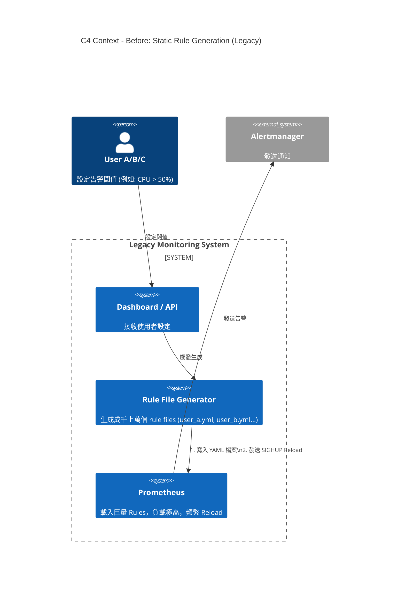
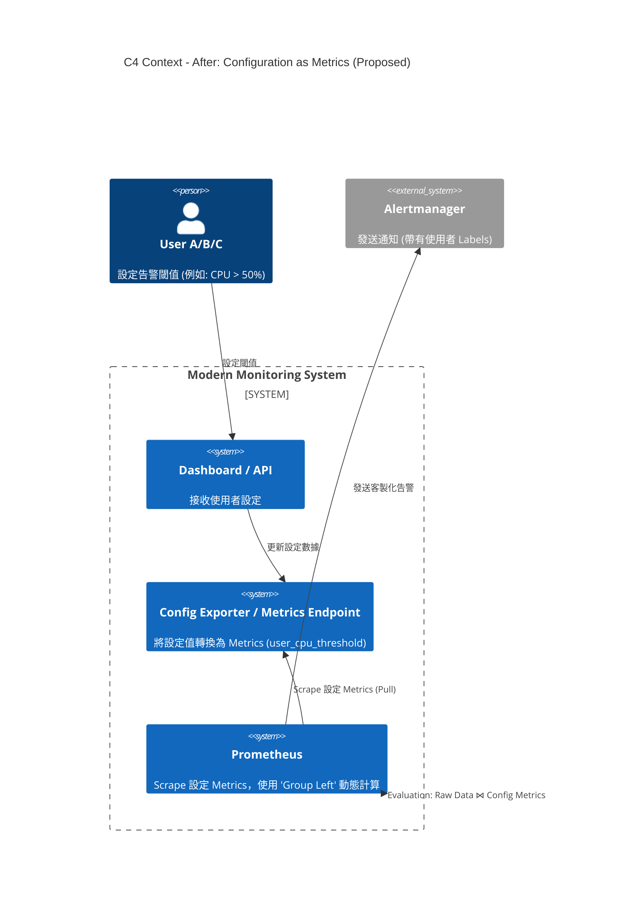

# 技術提案：基於「配置即數據」的高擴充性自訂告警架構

**Scalable User-Defined Alerting Architecture on Prometheus**

---

## 1. 背景與困境 (Background & Problem Statement)

隨著產品功能的迭代，我們的系統需要開放讓使用者（Tenants）針對其關注的資源（如 `subcomponent_B` 的 CPU/Memory）設定自定義告警閾值。目前的預估規模為數千至數萬名使用者，每人約 10-20 條規則。

若採用傳統的「一使用者一規則（One-Rule-Per-User）」模式，我們將面臨以下嚴峻挑戰：

1. **Rule Evaluation 效能瓶頸**：
* 預估將產生 200,000+ 條 Alert Rules。Prometheus 的 Evaluation Cycle 將因過度運算而超時，導致監控延遲甚至數據斷點。


2. **管理與維運風險**：
* 每次使用者修改閾值，都需要重新生成 Rule File 並觸發 Prometheus Reload。在高頻更新下，頻繁 Reload 會導致 Prometheus 記憶體波動與短暫的服務不可用。


3. **儲存資源浪費**：
* 若為了隔離而讓每個使用者存儲獨立的 Metrics 副本，儲存成本將線性膨脹，不具備可持續性。


---

## 2. 解決方案：配置即數據 (Proposed Solution: Configuration as Metrics)

我們建議摒棄「為每個使用者生成實體 Rule 檔案」的作法，轉而採用 **「配置即數據 (Configuration as Metrics)」** 模式。

### 核心設計理念

1. **解耦 (Decoupling)**：將「告警邏輯（Rule）」與「告警參數（Thresholds）」分離。
2. **動態化 (Dynamic)**：使用者的設定值被視為 **Metrics**，而非靜態配置。
3. **通用化 (Universal Rule)**：透過 **PromQL Join** 機制，僅需維護 **極少量的通用規則**，即可動態計算數萬名使用者的告警狀態。

### 架構效益 (Benefits & ROI)

* **效能優化 (High Performance)**：Rule 數量從 20 萬條收斂至 < 50 條。Evaluation 負載大幅降低。
* **零停機更新 (Zero Downtime)**：使用者修改設定僅體現為 Metrics 數值變化，**完全無需 Reload Prometheus**。
* **儲存精簡 (Storage Efficiency)**：原始數據僅需儲存一份，所有使用者共享，無需資料冗餘。

---

## 3. 架構視圖 (C4 Context Diagram)

為了清楚展示架構變更前後的差異，以下使用 C4 Context 層級進行圖解。

### 3.1 現狀/傳統模式 (Legacy Architecture)

* **痛點**：Rule Generator 需要頻繁寫入大量檔案，Prometheus 負擔過重。



### 3.2 提案架構 (Proposed Architecture)

* **改進**：移除了 Rule Generator，改為 Exporter。Prometheus 透過 Scrape 獲取設定，計算邏輯在查詢時動態結合。



---

## 4. 實作細節與邏輯流程 (Implementation Details)

本方案的實作分為三個關鍵層次：**資料源層**、**聚合層**、**邏輯層**。

### 4.1 資料源層 (Exporter Design)

使用者的設定不再寫入設定檔，而是由 Exporter 吐出 Metrics。

* **Metric Name**: `user_cpu_threshold`
* **Labels**: `user_name`, `target_component`, `severity`
* **Value**: 閾值本身 (Threshold Value)

**範例 Metrics:**

```text
user_cpu_threshold{user_name="User_A", target_component="subcomponent_B", severity="info"} 50
user_cpu_threshold{user_name="User_B", target_component="subcomponent_B", severity="warning"} 70

```

### 4.2 聚合層 (Recording Rules)

為了避免高基數 (High Cardinality) 的 Join 運算，我們引入 Recording Rule 進行預計算降維。

**檔案**: `recording_rules.yml`

```yaml
groups:
  - name: aggregation_rules
    interval: 1m
    rules:
      # 將底層 Pod/Container 數據聚合為 Component 層級的百分比
      - record: job:component_cpu_usage:percent
        expr: >
          sum by (component) (rate(container_cpu_usage_seconds_total[5m])) * 100

```

### 4.3 邏輯層 (Alerting Rules)

這是核心邏輯，使用 PromQL 的 `Many-to-One` Join 技術。

**檔案**: `alerting_rules.yml`

```yaml
groups:
  - name: dynamic_alerting
    interval: 1m
    rules:
      - alert: UserDefinedHighCPU
        annotations:
          summary: "CPU Usage High: {{ $value }}%"
          description: "User {{ $labels.user_name }} threshold: {{ $labels.threshold_value }}%"
        expr: |
          # 1. 取出聚合後的實際值
          job:component_cpu_usage:percent

          # 2. 動態比對：實際值 > 使用者設定值
          > on(component) group_left(user_name, severity)

          # 3. 取出設定值 (並將數值複製到 label 供顯示用)
          label_replace(user_cpu_threshold, "threshold_value", "$1", "__name__", "(.+)")

```

### 4.4 實際運作模擬

當 `subcomponent_B` 的 CPU 達到 **80%** 時：

1. **User A (設定 > 50%)**：`80 > 50` (True) -> **觸發告警** (Severity: info)
2. **User B (設定 > 70%)**：`80 > 70` (True) -> **觸發告警** (Severity: warning)
3. **User C (設定 > 95%)**：`80 > 95` (False) -> **不觸發**

---

## 5. 結論 (Conclusion)

本提案透過架構上的轉變，解決了多租戶監控中最棘手的擴充性問題。

* **For Users**: 獲得了即時生效的告警設定能力，且支援個人化的閾值與等級。
* **For Ops**: 擺脫了管理成千上萬個 Rule Files 的夢魘，Prometheus 運作更加穩定高效。
* **For Business**: 以最小的硬體與儲存成本，支撐了產品的高速成長。

建議立即啟動 **Exporter 開發** 與 **Recording Rule 驗證** 的 POC (Proof of Concept) 階段。
