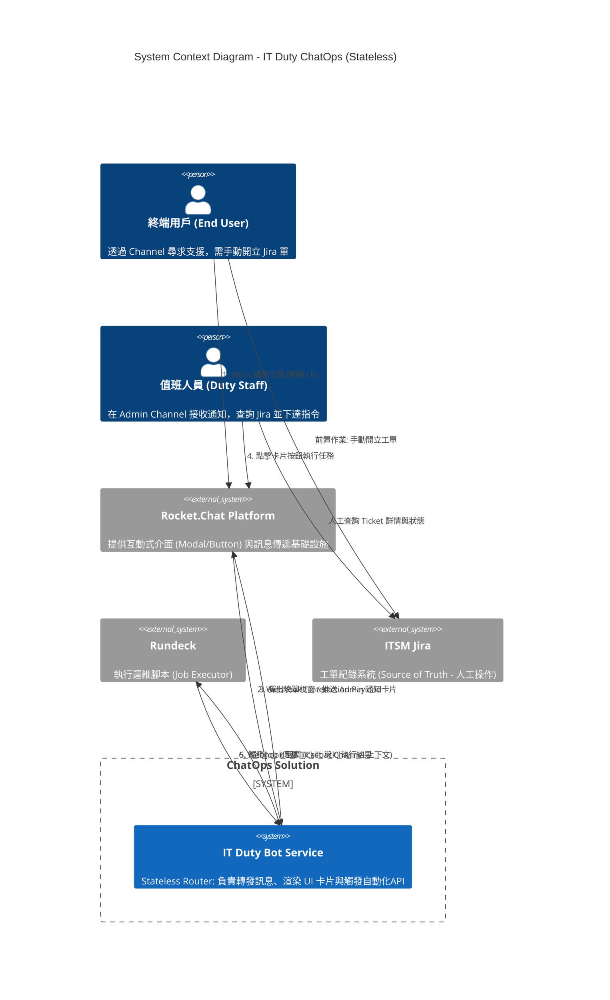
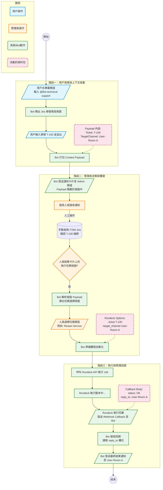

# IT Duty ChatOps 平台建置企劃書

**專案名稱：** Stateless Duty Command Center (無狀態值班中控台)
**版本：** v2.1 (Final Proposal)
**核心架構：** 無狀態 (Stateless) / 人機協作 (Human-in-the-Loop) / UI 驅動 (UI-Driven)
**關鍵技術：** Rocket.Chat (或類似平台), 自研 Bot API Service, Rundeck, ITSM Jira

---

## 1. 現況困境與挑戰 (Problem Statement)

目前的 IT 值班與維運流程存在以下結構性痛點，導致效率低落、維運風險增加與人員負擔過重：

1. **身分綁定與管理困難：** 值班人員被迫以「個人帳號」加入數十個外部專案群組來回應需求。這不僅模糊了公私界線，且當人員離職或輪調時，權限回收與群組退出變得極為繁瑣，存在資安隱憂。
2. **訊息噪音 (Alert Fatigue)：** 即便在非值班時間，人員的手機仍充斥著各個群組的非緊急通知，導致長期精神耗損，且真正緊急的訊息容易被淹沒在噪音中。
3. **流程斷裂與缺乏導引：**
* 用戶端：報修時資訊不足，不知道標準流程。
* 值班端：處理一個問題需在通訊軟體（溝通）、Jira（紀錄）、伺服器終端機（執行）之間頻繁切換，缺乏統一的操作入口。


4. **缺乏自動化與稽核：** 常見的標準維運操作（如重啟服務、清理庫存）仍依賴人工登入伺服器執行，缺乏統一的權限控管與標準化執行紀錄。

---

## 2. 解決方案與效益 (Proposed Solution & Benefits)

我們提議建置一套 **「IT Duty ChatOps 中台」**。
透過引入 **Bot（機器人代理）** 作為中間層，將雜亂的「人對人」溝通轉變為結構化的「人機協作」模式。

本方案採納 **無狀態 (Stateless)** 設計原則：Bot Service 本身不儲存對話狀態，而是利用通訊平台的 UI Payload 來傳遞上下文資訊，大幅降低系統維護成本。

### 核心效益 (ROI)

| 效益維度 | 說明 |
| --- | --- |
| **身分隱私與安全** | 外部群組僅需加入 Bot 帳號。值班人員透過後台（Admin Channel）操作，實現**身分去識別化**，且離職無需退群。 |
| **專注力管理** | Bot 僅將需求推播至單一的「Admin 專屬頻道」，確保僅有當班人員收到通知，實現**下班即離線**。 |
| **流程標準化** | 強制要求用戶輸入 Jira 單號始可報修；利用卡片式 UI 引導值班人員執行標準化腳本，減少人為失誤。 |
| **極簡架構** | 利用 UI Payload 與 Rundeck 參數傳遞上下文，**無需維護額外的資料庫 (No-SQL Dependency)**，降低系統複雜度與維運成本。 |

---

## 3. 系統架構設計 (System Architecture)

我們使用 C4 Model 的 Context 圖來描述系統邊界與角色互動。本架構強調 Bot Service 作為「輕量級智慧路由器」的角色。

### C4 System Context Diagram



---

## 4. 核心業務流程 (Core Workflows)

此流程圖展示了在無資料庫的情況下，**Context Payload (上下文資料包)** 如何像接力棒一樣，在用戶、Bot、管理員與 Rundeck 之間傳遞，最終實現閉環通知。



---

## 5. 詳細規格與資料建模 (Data & Interaction Specs)

由於採用 Stateless 架構，我們不定義資料庫 Schema，而是定義 **系統間互動的 JSON Payload 結構**。

### 5.1 Rocket.Chat UI Interaction

#### A. 管理員通知卡片 (Admin Notification Card)

**關鍵設計：** 將用戶的來源頻道與單號資訊隱藏在按鈕的 `value` 欄位中，實現狀態傳遞。

```json
{
  "text": "🚨 新的支援請求",
  "attachments": [
    {
      "color": "#FF0000",
      "fields": [
        { "title": "Ticket", "value": "OPS-1024", "short": true },
        { "title": "User", "value": "@john.doe", "short": true },
        { "title": "Origin", "value": "#project-alpha", "short": true }
      ],
      "actions": [
        {
          "type": "button",
          "text": "🛠️ 執行任務 (Run Task)",
          "action_id": "admin_open_run_modal",
          "value": "{\"ticket\":\"OPS-1024\", \"target_channel\":\"ROOM_ID_USER_123\"}"
        },
        {
          "type": "button",
          "text": "🔗 開啟 Jira",
          "url": "https://jira.company.com/browse/OPS-1024"
        }
      ]
    }
  ]
}

```

### 5.2 Rundeck 整合規格

#### A. Bot 觸發 API Payload (To Rundeck)

Bot 將從 UI 收集到的資訊轉換為 Rundeck 的 Job Options 參數。

```json
{
  "argString": "-ticket_id OPS-1024 -target_channel ROOM_ID_USER_123 -requested_by admin_user",
  "loglevel": "INFO",
  "asUser": "bot_account"
}

```

#### B. Rundeck Webhook Callback Payload (From Rundeck)

Rundeck 執行結束後，透過 Notification Plugin 將參數原封不動地回傳。

```json
{
  "execution_id": "9981",
  "status": "succeeded",
  "job_name": "Restart Web Service",
  "custom_options": {
    "ticket_id": "OPS-1024",
    "reply_to_channel": "ROOM_ID_USER_123"
  },
  "message": "Service restart completed successfully."
}

```