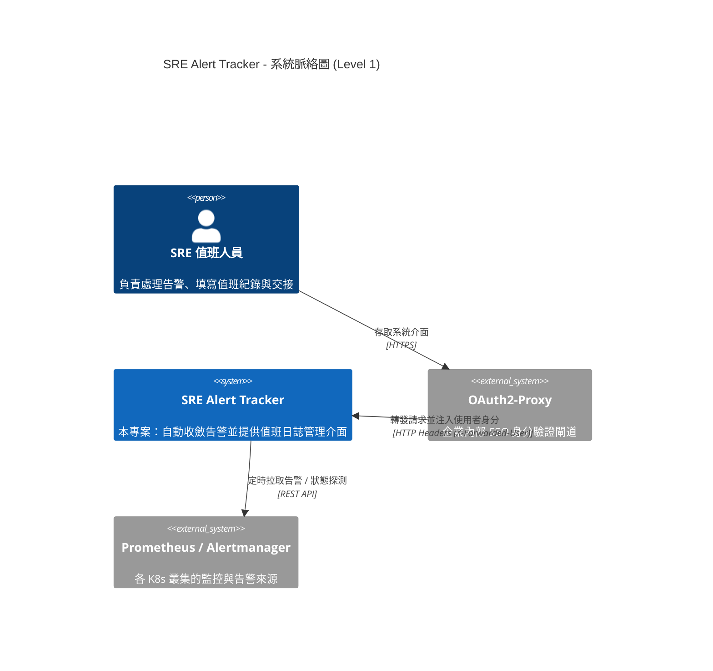
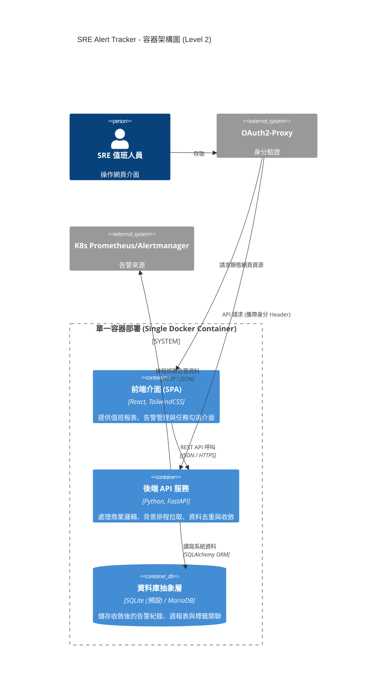

# 專案提案：SRE 告警追蹤與值班日誌系統 (SRE Alert Tracker)
---

## 1. 背景與痛點分析

目前團隊負責維護多座 Kubernetes 叢集與其上的產品線。每座叢集皆配置了 Prometheus 與 Alertmanager 進行監控。當告警觸發時，SRE 團隊會進行應對處理。然而，在現行的值班與紀錄流程中，我們面臨以下痛點：

* **人工紀錄的 Toil (無價值重複勞動) 過高**：現行仰賴人工統計與填寫處理紀錄。當「告警風暴 (Alert Storm)」發生時，值班人員光是救火已分身乏術，事後還要依賴大腦回憶並手動整理海量告警，導致嚴重的「值班疲勞」。
* **缺乏有效的告警收斂機制**：同一個問題（如同一台機器的 CPU 飆高）在短時間內反覆觸發與恢復 (Flapping)，會產生大量雜訊，難以聚焦於根本原因。
* **歷史經驗難以傳承與檢索**：目前的紀錄方式不利於標籤化 (Labeling) 與跨週期的趨勢分析。當類似的告警再次發生時，難以快速查閱過去的「現象、影響與嘗試處理作法」。
* **每週任務追蹤缺乏系統化**：值班人員每週有固定的例行檢查項目，目前缺乏動態、可追蹤的 Checkbox 機制與報表整合。

### 1.1 現況與未來流程對比 (As-Is vs. To-Be)

為了具體說明本系統將如何翻轉團隊的工作模式，以下列出現況與系統導入後的關鍵對比：

| 比較維度 | 現況 (As-Is) | 導入本系統後 (To-Be) | 創造價值 (Impact) |
| --- | --- | --- | --- |
| **資料收集** | 值班人員需手動跨多個 Cluster 的 Dashboard 翻找、複製貼上告警紀錄。 | **系統排程自動拉取**，單一介面集中檢視所有來源的告警狀態。 | 消除「搬運工」式的純勞力作業，將時間還給技術除錯。 |
| **雜訊處理** | 告警風暴洗版，同一個根因可能產生數十筆相同的告警紀錄，干擾判斷。 | **基於 Fingerprint 智能收斂**，相同事件僅留一筆紀錄，動態更新「發生次數」。 | 介面雜訊大幅降低，值班人員一眼看清系統真實的異常數量。 |
| **交接與報表** | 散落的筆記或試算表，依賴大腦記憶確認「每週例行檢查項目」是否做完。 | 系統**按週自動生成報表框架與動態 Checkbox**，直接在收斂後的告警旁填寫紀錄。 | 標準化值班交接流程，確保每個步驟被妥善追蹤與紀錄。 |
| **知識沉澱** | 歷史紀錄難以搜尋，缺乏結構化標籤，難以進行跨週期的趨勢分析。 | **結構化標籤管理 (Labels)**，支援多維度篩選與 PDF/CSV 匯出。 | 輕易轉化為架構改善的數據佐證，將「個人經驗」轉為「團隊資產」。 |

## 2. 專案目標與預期效益

我們計畫開發一款專為內部 SRE 打造的輕量級告警追蹤系統 (SRE Alert Tracker)，旨在達成以下目標：

1. **自動化拉取與智能收斂**：系統定時從各叢集的 Alertmanager/Prometheus 拉取告警，並透過 Fingerprint 進行精準去重 (Dedup)，將重複發生的告警收斂為單一事件。
2. **標準化值班報表與交接**：系統自動按週生成報表框架與動態例行任務 Checkbox。值班人員只需針對收斂後的事件填寫處理紀錄，並支援多人協作與負責人追蹤。
3. **建立 SRE 知識庫**：透過自訂 Label 與關聯式紀錄，沉澱團隊的除錯經驗，並支援依據時間、叢集、Label 等維度進行篩選與匯出 (PDF/CSV)。
4. **極低維運成本 (Zero-friction)**：系統採用單一 Docker Image 打包，支援 SQLite 開箱即用，並保留無縫切換至外部 MariaDB 的彈性，不增加團隊維運負擔。

---

## 3. 系統架構設計 (C4 Model)

為了釐清系統邊界與元件互動，以下說明核心架構設計。

### 3.1 系統脈絡圖 (System Context Diagram)

本系統作為 SRE 團隊的核心工作站，整合了既有的認證閘道與各環境的監控資料源。

### 3.2 容器架構圖 (Container Diagram)

系統採輕量化設計，前後端分離開發但整合打包於單一容器中，降低部署複雜度。

---

## 4. 核心業務流程 (Workflow)

1. **告警收斂與寫入機制**：
* 背景排程啟動 $\rightarrow$ 讀取叢集設定檔並驗證來源 Endpoint 活性。
* 呼叫 Alertmanager API 與 Prometheus 歷史紀錄 $\rightarrow$ 擷取告警。
* 系統依據 `fingerprint` 與當週報表 ID 進行比對 $\rightarrow$ 若已存在則更新 `發生次數` 與 `最後發生時間`；若不存在則建立新紀錄。

2. **值班交接與紀錄填寫**：
* SRE 登入系統 $\rightarrow$ 進入當週自動生成的報表框架。
* 檢視已自動收斂且按日分群的告警清單 $\rightarrow$ 點擊特定告警，填寫「現象、影響、處理作法」。
* 勾選完成本週指定的系統檢查任務 Checkbox $\rightarrow$ 完成交接或匯出 PDF/Excel 留存。

## 5. 預期成效指標 (Success Metrics)

系統導入後，我們將透過以下指標來衡量專案成效：

* **值班工時節省**：預期減少值班人員每週用於手動統計告警與撰寫報表的時間達 50% 以上。
* **告警雜訊降低率**：透過 Fingerprint 收斂機制，預期能將原始告警觸發次數壓縮至實際需處理事件數的 20% 以下，大幅提升版面可讀性。
* **知識沉澱覆蓋率**：追蹤每月高嚴重性 (Critical) 告警中，具備完整「現象/影響/作法」紀錄與正確標籤的比例，目標達 90% 以上。

## 6. 開發與導入計畫

專案將採敏捷式迭代進行，分為三個主要階段：

* **Phase 1: 核心功能與單機驗證 (MVP)**
* 完成資料庫 Schema 設計與 FastAPI + React 基礎 CRUD。
* 實作核心排程拉取與 Fingerprint 收斂邏輯。
* 支援 SQLite 單機啟動，並介接單一測試叢集進行準確度驗證。

* **Phase 2: 完整流程整合與內部試營運**
* 實作每週報表自動生成、動態 Checkbox 與 Label 管理功能。
* 完成 OAuth2-Proxy 身分驗證對接，實作操作者足跡追蹤。
* 部署至 K8s 內部環境，涵蓋所有正式叢集，邀請團隊進行雙軌並行試填。

* **Phase 3: 進階功能與正式上線**
* 實作前端資料篩選與 CSV/Excel/PDF 匯出功能。
* 實作資料保留策略 (Retention Purge) 定期清理機制。
* 視資料量成長狀況，評估並決定是否切換連線至團隊內部的 MariaDB。

---
